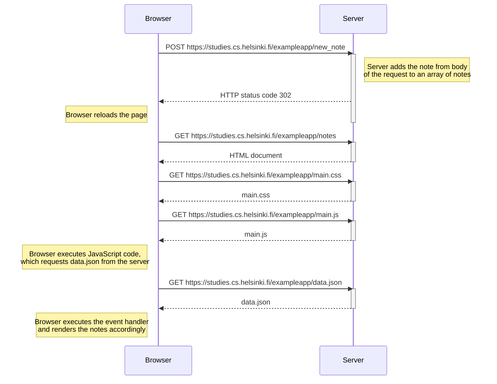

```mermaid
  sequenceDiagram

    participant Browser
    participant Server

    Browser->>Server: POST https://studies.cs.helsinki.fi/exampleapp/new_note
    activate Server
    Note right of Server: Server adds the note from body <br> of the request to an array of notes
    Server-->>Browser: HTTP status code 302
    Note left of Browser: Browser reloads the page
    deactivate Server

    Browser->>Server: GET https://studies.cs.helsinki.fi/exampleapp/notes
    activate Server
    Server-->>Browser: HTML document
    deactivate Server

    Browser->>Server: GET https://studies.cs.helsinki.fi/exampleapp/main.css
    activate Server
    Server-->>Browser: main.css
    deactivate Server

    Browser->>Server: GET https://studies.cs.helsinki.fi/exampleapp/main.js
    activate Server
    Server-->>Browser: main.js
    deactivate Server

    Note left of Browser: Browser executes JavaScript code, <br> which requests data.json from the server

    Browser->>Server: GET https://studies.cs.helsinki.fi/exampleapp/data.json
    activate Server
    Server-->>Browser: data.json
    deactivate Server

  Note left of Browser: Browser executes the event handler <br> and renders the notes accordingly
```