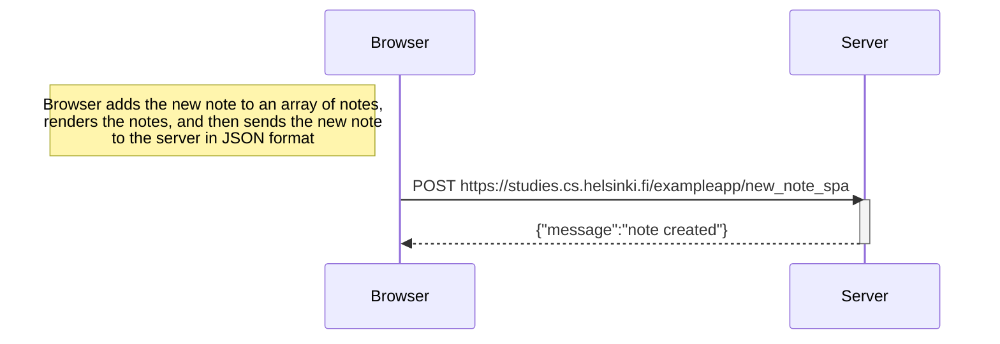

```mermaid
  sequenceDiagram

    participant Browser
    participant Server

    Note left of Browser: Browser adds the new note to an array of notes, <br> renders the notes, and then sends the new note <br> to the server in JSON format

    Browser->>Server: POST https://studies.cs.helsinki.fi/exampleapp/new_note_spa
    activate Server
    Server-->>Browser: {"message":"note created"}
    deactivate Server
```